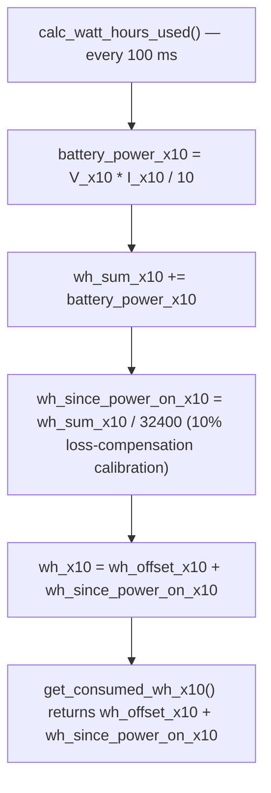
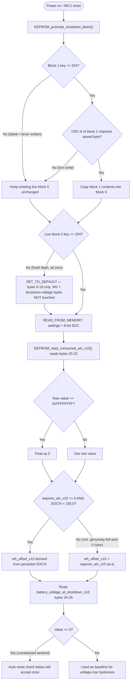
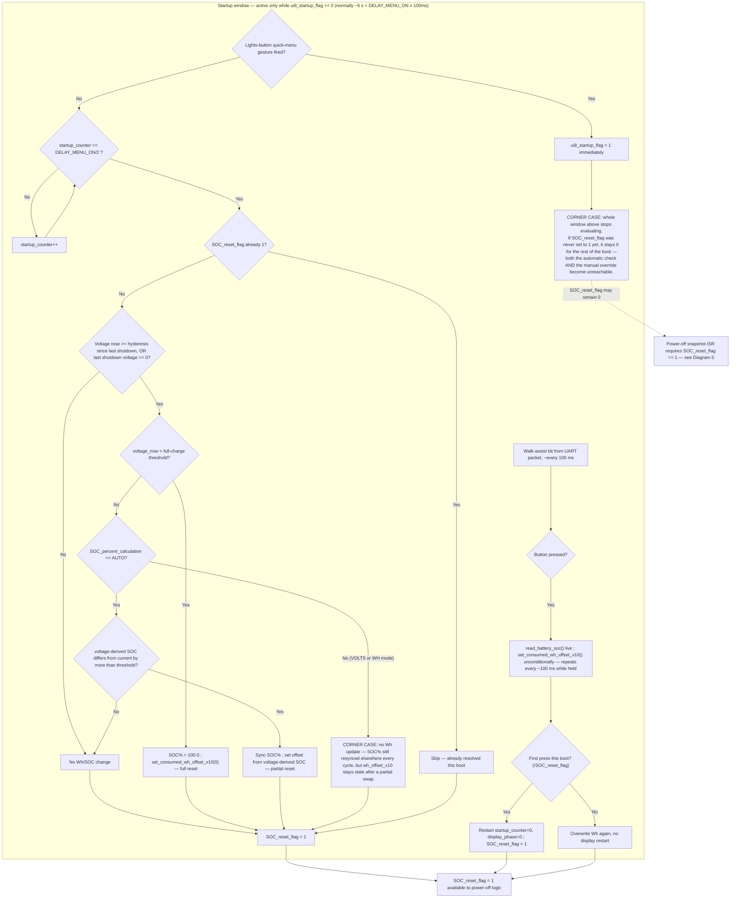
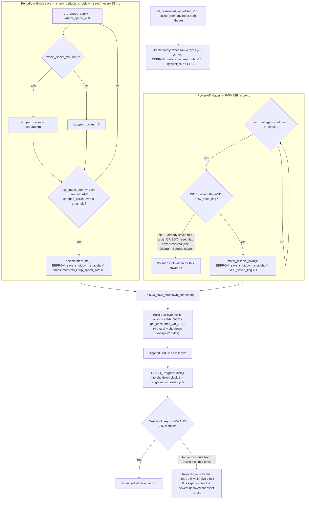
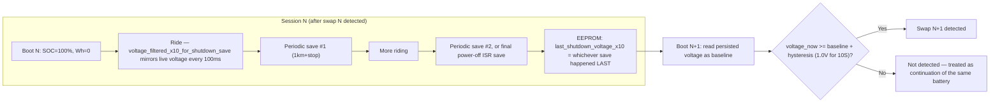

# Wh measurement handling
_Exported on 8/13/2026 at 07:59:16 GMT+2 from Cursor (3.15.6)_

---

**User**

analyze and explain the handling of the measured Wh and their persistence during power cycles

---

**Cursor**

Now let's look at the actual power-off save trigger and the SOC/Wh calculation loop (around line 4160-4270), plus where `EEPROM_save_shutdown_snapshot` is called at true power-off (likely in main.c on brake/power-off detection).

Let's look at motor.c around line 1017 for the power-off save trigger, and check.h/common.h for the periodic-save constants and battery capacity config.

## Overview

The firmware tracks cumulative energy drawn from the battery ("consumed Wh", stored as **Wh × 10** for fixed-point precision) and needs that value to survive both a clean power-off and an abrupt one (battery unplugged, connector bounce, BMS cut-off). This is handled by a RAM accumulator that is periodically and unconditionally snapshotted to the STM8's data EEPROM using a CRC-protected, dual-block scheme.

## 1. RAM state (per power-on session)

```95:98:src/ebike_app.c
static uint32_t ui32_wh_x10 = 0;
static uint32_t ui32_wh_sum_x10 = 0;
volatile uint32_t ui32_wh_offset_x10 = 0;
static uint32_t ui32_wh_since_power_on_x10 = 0;
```

- `ui32_wh_offset_x10` — Wh×10 already consumed *before* this power-on (restored from EEPROM/SOC at boot).
- `ui32_wh_sum_x10` — raw running accumulator of instantaneous battery power samples for *this* session.
- `ui32_wh_since_power_on_x10` — `ui32_wh_sum_x10` converted to Wh×10 for this session.
- `ui32_wh_x10` — total consumed Wh×10 since the last full-charge/reset event (`offset + since_power_on`), used for display and for the "auto"/"Wh" SOC calculation modes.

## 2. Accumulation (`calc_watt_hours_used`)

Called every 4th 25 ms controller cycle → **100 ms period**:

```617:625:src/ebike_app.c
	switch (ui8_counter++ & 0x03) {
		...
		case 1:
			ebike_control_lights();
			calc_oem_wheel_speed();
			calc_watt_hours_used();
			break;
```

```4117:4128:src/ebike_app.c
static void calc_watt_hours_used(void)
{
	// battery power x 10
	ui16_battery_power_x10 = (uint16_t)(((uint32_t) ui16_battery_voltage_calibrated_and_filtered_x10 * ui8_battery_current_filtered_x10) / 10);
	
	// consumed watt-hours
	ui32_wh_sum_x10 += ui16_battery_power_x10;
	// calculate watt-hours X10 since power on
	ui32_wh_since_power_on_x10 = ui32_wh_sum_x10 / 32400; // 36000 -10% calibration to compensate for battery losses
	// calculate watt-hours X10 since last full charge
	ui32_wh_x10 = ui32_wh_offset_x10 + ui32_wh_since_power_on_x10;
}
```

At 10 samples/second, dividing the accumulated power-x10 sum by 36000 would give an exact Wh×10 integral. The code instead divides by 32400 (`36000 × 0.9`), deliberately inflating the result by ~11% to account for battery-internal losses not visible at the voltage/current measurement point — i.e. it purposely reports a slightly *pessimistic* (higher) consumption.

`get_consumed_wh_x10()` is the accessor used by both the display logic and the EEPROM writer:

```4111:4114:src/ebike_app.c
uint32_t get_consumed_wh_x10(void)
{
	return ui32_wh_offset_x10 + ui32_wh_since_power_on_x10;
}
```

## 3. Restoring the value at power-on

```481:491:src/ebike_app.c
	// consumed watt-hours x10 at power on from EEPROM, or SOC fallback when EEPROM is empty
	{
		uint32_t ui32_eeprom_wh_x10 = EEPROM_read_consumed_wh_x10();

		if ((ui32_eeprom_wh_x10 == 0U) && (ui16_battery_SOC_percentage_x10 < 1000U)) {
			ui32_wh_offset_x10 = ((uint32_t)(1000 - ui16_battery_SOC_percentage_x10) * ui16_actual_battery_capacity) / 100;
		}
		else {
			ui32_wh_offset_x10 = ui32_eeprom_wh_x10;
		}
	}
```

- Normally, `ui32_wh_offset_x10` is simply the last persisted value from EEPROM.
- If the EEPROM read returns `0` (blank/erased EEPROM after flashing — per the workspace rule, a freshly flashed chip reads `0`) **and** the SOC (itself persisted separately as a 1-byte percentage) shows less than 100%, the offset is *derived* from the persisted SOC percentage instead. This is a fallback so a bike that already has some charge used, but has never written the Wh field (e.g. right after a firmware update), doesn't start reporting 0 Wh consumed.
- `EEPROM_read_consumed_wh_x10()` also treats an all-ones read (`0xFFFFFFFF`, the classic "erased flash" pattern) as `0`, so both possible blank states map to "nothing persisted yet":

```301:314:src/eeprom.c
uint32_t EEPROM_read_consumed_wh_x10(void) {
        uint32_t ui32_value;
    
        ui32_value = (uint32_t)FLASH_ReadByte(ADDRESS_CONSUMED_WH_X10_0);
        ...
        if (ui32_value == 0xFFFFFFFFUL) {
            return 0;
        }
    
        return ui32_value;
}
```

## 4. Where/when Wh gets reset to 0 (or resynced)

`set_consumed_wh_offset_x10()` is the single choke point that changes the offset, resets the per-session accumulators, and immediately persists the raw 4-byte Wh field:

```4102:4108:src/ebike_app.c
static void set_consumed_wh_offset_x10(uint32_t offset_x10)
{
	ui32_wh_offset_x10 = offset_x10;
	ui32_wh_sum_x10 = 0;
	ui32_wh_since_power_on_x10 = 0;
	EEPROM_write_consumed_wh_x10(offset_x10);
}
```

It's called in three situations, all gated by a voltage-rise "battery change detected" heuristic that avoids falsely resetting Wh on every short ride where the resting voltage happens to sit above the "full" threshold:

```4141:4152:src/ebike_app.c
static uint8_t is_battery_change_detected(uint16_t voltage_x10, uint16_t last_shutdown_voltage_x10)
{
	// blank/uninitialized EEPROM (0x00 on STM8) -> accept once so a full battery still resets SOC
	if (last_shutdown_voltage_x10 == 0) {
		return 1;
	}
	// voltage rose by at least the hysteresis margin since the last power-off -> battery charged/swapped
	if (voltage_x10 >= (uint16_t)(last_shutdown_voltage_x10 + BATTERY_SOC_RESET_RISE_HYSTERESIS_X10)) {
		return 1;
	}
	return 0;
}
```

1. **Full-charge/battery-swap at power-on**, once per boot (during the startup display window), only if the unloaded voltage rose since the last recorded shutdown voltage:

```4227:4249:src/ebike_app.c
				if (!ui8_battery_SOC_reset_flag) {
					...
					if (is_battery_change_detected(ui16_battery_voltage_calibrated_and_filtered_x10,
												   ui16_battery_voltage_at_last_shutdown_x10)) {
						// if the battery is fully charged
						if (ui16_battery_voltage_calibrated_and_filtered_x10 > BATTERY_VOLTAGE_RESET_SOC_PERCENT_X10) {
							ui16_battery_SOC_percentage_x10 = 1000;
							set_consumed_wh_offset_x10(0);
						}
						// if SOC calculation is set to auto: a non-full but charged/swapped pack
						else if (m_configuration_variables.ui8_soc_percent_calculation == SOC_CALC_AUTO) {
							...
							set_consumed_wh_offset_x10(((uint32_t)(1000 - ui16_battery_SOC_percentage_x10) * ui16_actual_battery_capacity) / 100);
						}
					}
					ui8_battery_SOC_reset_flag = 1;
				}
```

2. **Manual reset via the walk-assist button** held during the first 5 seconds of power-on, which forcibly resyncs Wh to the voltage-derived SOC regardless of the hysteresis check:

```3118:3129:src/ebike_app.c
			// manual setting battery SOC percentage x10 (actual charge)
			// walk assist button pressed within 5 seconds of power on
			if ((ui8_walk_assist_button_pressed)&&(!ui8_startup_flag)) {
				ui16_battery_SOC_percentage_x10 = read_battery_soc();
				set_consumed_wh_offset_x10(((uint32_t)(1000 - ui16_battery_SOC_percentage_x10) * ui16_actual_battery_capacity) / 100);
```

## 5. Persistence to EEPROM — two mechanisms

### a) Lightweight 4-byte write (immediate, on offset changes)

Every call to `set_consumed_wh_offset_x10()` also calls `EEPROM_write_consumed_wh_x10()`, which unlocks the data EEPROM, writes the 4 bytes little-endian, and locks it again:

```270:299:src/eeprom.c
static void EEPROM_program_consumed_wh_x10(uint32_t ui32_value) {
    ...
    for (ui8_i = 0; ui8_i < 4; ui8_i++) {
        ui32_address = (uint32_t)ADDRESS_CONSUMED_WH_X10_0 + ui8_i;
        FLASH_ProgramByte(ui32_address, (uint8_t)(ui32_value >> (ui8_i * 8)));
        while (FLASH_GetFlagStatus(FLASH_FLAG_EOP) == RESET) {
        }
    }
}
```

### b) Full 128-byte block snapshot with CRC (used at real power-off and periodically mid-ride)

The EEPROM's live configuration area is organized as two fixed-size `FLASH_BLOCK_SIZE` (128-byte) blocks:

```48:56:src/eeprom.h
// Block-based power-off persistence: the data EEPROM is treated as fixed-size blocks of
// FLASH_BLOCK_SIZE bytes, each programmed in a single FLASH_ProgramBlock() cycle.
// Block 0 holds the authoritative live configuration that is read at startup; block 1 holds
// the snapshot written at power-off. On boot a valid block 1 is promoted into block 0.
#define EEPROM_LIVE_BLOCK								0
#define EEPROM_SHUTDOWN_BLOCK							1
```

`EEPROM_save_shutdown_snapshot()` builds an in-RAM image containing all settings + battery SOC + `get_consumed_wh_x10()` + the unloaded battery voltage, appends a CRC-8 as the last byte, and writes the whole block in **one** `FLASH_ProgramBlock()` cycle (atomic from the CPU's perspective, minimizing the chance of a torn/partial write if power dies mid-write):

```336:364:src/eeprom.c
void EEPROM_write_block_with_crc(uint8_t ui8_block_index, uint8_t *ui8_buffer) {
    // append the CRC-8 of all data bytes as the last byte of the block so the stored block
    // can be validated on the next startup before it is trusted
    ui8_buffer[FLASH_BLOCK_SIZE - 1] = EEPROM_crc8(ui8_buffer, FLASH_BLOCK_SIZE - 1);
    ...
```

```405:425:src/eeprom.c
    // consumed watt-hours x10 at power-off, stored little-endian across 4 bytes
    ui32_consumed_wh_x10 = get_consumed_wh_x10();
    ui8_buffer[ADDRESS_CONSUMED_WH_X10_0 - EEPROM_BASE_ADDRESS] = (uint8_t)(ui32_consumed_wh_x10 & 0xFF);
    ...
void EEPROM_save_shutdown_snapshot(void) {
    uint8_t ui8_block[FLASH_BLOCK_SIZE];

    // assemble the current configuration + dynamic values, then persist it as the shutdown
    // snapshot in a single block-programming cycle
    EEPROM_build_live_block(ui8_block);
    EEPROM_write_block_with_crc(EEPROM_SHUTDOWN_BLOCK, ui8_block);
}
```

This snapshot is written from **two triggers**:

**Trigger 1 — genuine shutdown**, detected in the PWM ISR in `motor.c` when the ADC-sampled battery voltage drops below a threshold (BMS cutoff / user unplugging is imminent):

```1006:1021:src/motor.c
    // save remaining battery capacity and consumed Wh at shutdown
    if ((ui16_adc_voltage < BATTERY_VOLTAGE_SHUTDOWN_10_BIT)
        &&(!ui8_battery_SOC_saved_flag)
        &&(ui8_battery_SOC_reset_flag))
    {
        // disable pwm at shutdown
        ui8_motor_enabled = 0;
        motor_disable_pwm();
            
        // persist the full configuration snapshot (settings + battery SOC + consumed Wh) in a
        // single block-programming cycle; the next startup promotes it into the live block
        EEPROM_save_shutdown_snapshot();
            
        // battery SOC saved
        ui8_battery_SOC_saved_flag = 1;
    }
```

`ui8_battery_SOC_saved_flag` (RAM-only, reset to 0 every power-on) ensures this fires only once per shutdown event, and also gates the motor off (`ui8_battery_SOC_saved_flag` is checked in the safety/motor-enable logic elsewhere in `ebike_app.c`) so the controller doesn't keep drawing power while writing to EEPROM.

**Trigger 2 — periodic mid-ride save**, so an *abrupt* power loss (loose connector, BMS trip) during a long ride still only loses at most the energy consumed since the last checkpoint. It fires once the bike has covered ≥1 km and then stood still for ≥5 s (so the write — done with interrupts disabled — can't corrupt an in-progress motor control cycle):

```68:70:src/common.h
#define ENABLE_PERIODIC_SHUTDOWN_SAVE 1
#define PERIODIC_SAVE_MIN_TRIP_DISTANCE_MM 1000000UL  // 1 km
#define PERIODIC_SAVE_STOPPED_SECONDS      5U
```

```1859:1889:src/ebike_app.c
#if ENABLE_PERIODIC_SHUTDOWN_SAVE
// Persists the shutdown snapshot mid-ride once enough distance has been covered and the
// bike has then stood still long enough, so a sudden power loss loses little SOC/Wh data.
static void check_periodic_shutdown_save(void)
{
    ui32_periodic_save_trip_speed_sum += ui16_wheel_speed_x10;

    if (ui16_wheel_speed_x10 == 0U) {
        if (ui16_periodic_save_stopped_cycles < PERIODIC_SAVE_STOPPED_CYCLES) {
            ui16_periodic_save_stopped_cycles++;
        }
    } else {
        ui16_periodic_save_stopped_cycles = 0;
    }

    if ((ui32_periodic_save_trip_speed_sum >= PERIODIC_SAVE_TRIP_SUM_THRESHOLD)
        && (ui16_periodic_save_stopped_cycles >= PERIODIC_SAVE_STOPPED_CYCLES)) {
        disableInterrupts();
        EEPROM_save_shutdown_snapshot();
        enableInterrupts();

        ui32_periodic_save_trip_speed_sum = 0;
    }
}
#endif
```

## 6. Restoring the block at the next boot

On every `EEPROM_init()`, before anything else is read, the code checks whether block 1 (the shutdown snapshot) is valid and, if so, copies it into block 0 (the live block) that the rest of `EEPROM_controller(READ_FROM_MEMORY, ...)` reads from:

```437:465:src/eeprom.c
static uint8_t EEPROM_promote_shutdown_block(void) {
    ...
    // reject a blank/never-written block: a freshly flashed data EEPROM reads 0x00, so the
    // key (which is non-zero for a valid block) catches that case before the CRC is trusted
    if (ui8_block[ADDRESS_KEY - EEPROM_BASE_ADDRESS] != DEFAULT_VALUE_KEY) {
        return 0;
    }

    // reject a corrupted / partially written block
    if (EEPROM_crc8(ui8_block, FLASH_BLOCK_SIZE - 1) != ui8_block[FLASH_BLOCK_SIZE - 1]) {
        return 0;
    }

    // snapshot is valid: overwrite the live block with it so the normal read path picks it up
    EEPROM_write_block_with_crc(EEPROM_LIVE_BLOCK, ui8_block);

    return 1;
}
```

This gives two layers of defense against a torn write during power loss:
- The **key byte** (`DEFAULT_VALUE_KEY = 204`) distinguishes a written block from a blank/erased one (which per the workspace convention reads all-zero after flashing).
- The **CRC-8** over the rest of the block catches a partially-programmed block (power died mid-`FLASH_ProgramBlock`), so a corrupted snapshot is simply discarded and the previous live block (from an earlier, successful save) is kept instead.

## Summary of the full lifecycle

1. Every 100 ms, instantaneous battery power is integrated into `ui32_wh_sum_x10` → `ui32_wh_since_power_on_x10` (with an 11% loss-compensation calibration).
2. `ui32_wh_x10 = ui32_wh_offset_x10 + ui32_wh_since_power_on_x10` is the live total, used for display and for SOC-from-Wh calculation.
3. On power-off (voltage-drop ISR trigger) or every ~1 km + 5 s-stopped mid-ride, the full config+SOC+Wh+voltage state is written atomically as a CRC-checked 128-byte block to a dedicated "shutdown" EEPROM block.
4. On the next boot, that block is validated (key + CRC) and promoted into the "live" block before any settings are read; `ui32_wh_offset_x10` is restored from it (or derived from the persisted SOC% if the Wh field itself is still blank).
5. The offset — and the persisted Wh value — is reset to a fresh baseline only when a real recharge/battery-swap is detected (voltage rose past the hysteresis margin since the last recorded shutdown voltage) or via the manual walk-assist-button override, preventing spurious resets on every short ride.

---

**User**

how is the hysteresis set and how does the reset "via the manual walk-assist-button" work?

---

**Cursor**

## 1. How the voltage-rise hysteresis is set

The hysteresis margin used by `is_battery_change_detected()` is a `main.h` macro derived from the cell count:

```456:456:src/main.h
#define BATTERY_SOC_RESET_RISE_HYSTERESIS_X10   (uint16_t)(BATTERY_CELLS_NUMBER * 1)
```

`BATTERY_CELLS_NUMBER` comes from the generated `config.h` (in this build, `10`):

```26:26:src/config.h
#define BATTERY_CELLS_NUMBER 10
```

All the `*_X10` voltage constants in this file are **pack voltage × 10** (e.g. `BATTERY_SOC_VOLTS_FULL_X10 = CELLS * (LI_ION_CELL_VOLTS_FULL * 10)`), so `BATTERY_SOC_RESET_RISE_HYSTERESIS_X10` is likewise in tenths-of-a-volt of the *whole pack*. With `BATTERY_CELLS_NUMBER * 1`, the margin is exactly **1 unit (0.1 V) per cell**, scaled by cell count so the threshold stays proportionally meaningful regardless of pack voltage/series count. For this 10S config that's `10 × 1 = 10` → **1.0 V** total-pack rise required.

It's consumed here:

```4141:4152:src/ebike_app.c
static uint8_t is_battery_change_detected(uint16_t voltage_x10, uint16_t last_shutdown_voltage_x10)
{
	// blank/uninitialized EEPROM (0x00 on STM8) -> accept once so a full battery still resets SOC
	if (last_shutdown_voltage_x10 == 0) {
		return 1;
	}
	// voltage rose by at least the hysteresis margin since the last power-off -> battery charged/swapped
	if (voltage_x10 >= (uint16_t)(last_shutdown_voltage_x10 + BATTERY_SOC_RESET_RISE_HYSTERESIS_X10)) {
		return 1;
	}
	return 0;
}
```

So: the calibrated, filtered **unloaded** pack voltage measured at this power-on must be at least 1.0 V higher than the unloaded voltage that was recorded at the *previous* shutdown for the automatic reset logic to even consider resetting Wh/SOC. A short ride where the resting voltage is essentially unchanged (or even slightly lower from cell aging/temperature) won't clear this bar, so it won't spuriously reset the odometer-style Wh counter every power cycle — only an actual charge or swap to a fuller pack raises the resting voltage enough to trigger it.

## 2. How the manual walk-assist-button reset works

This is a **separate, unconditional path** that bypasses the voltage-hysteresis check entirely — it's a deliberate user override.

**a) Where the button state comes from:** it's decoded live from the UART packet the display sends every ~100 ms, bit `0x20` of byte 1:

```2688:2691:src/ebike_app.c
			// mask walk assist button from display
			ui8_walk_assist_button_pressed = ui8_rx_buffer[1] & 0x20;
```

**b) Where/when the reset check runs:** it lives inside `uart_receive_package()` (called once every 4th 25 ms controller cycle, i.e. ~every 100 ms, whenever a valid packet was received):

```3116:3133:src/ebike_app.c
			// special features with walk assist button ******************
			
			// manual setting battery SOC percentage x10 (actual charge)
			// walk assist button pressed within 5 seconds of power on
			if ((ui8_walk_assist_button_pressed)&&(!ui8_startup_flag)) {
				ui16_battery_SOC_percentage_x10 = read_battery_soc();
				set_consumed_wh_offset_x10(((uint32_t)(1000 - ui16_battery_SOC_percentage_x10) * ui16_actual_battery_capacity) / 100);
				if (!ui8_battery_SOC_reset_flag) {
					ui8_battery_SOC_reset_flag = 1;
					// restart startup counter
					ui8_startup_counter = 0;
					// show SOC% for a full first half again before Wh
					ui8_startup_display_phase = 0;
				}
				// for display soc %
				ui8_display_data_on_startup = 1; // SOC%
				ui8_display_data_enabled = 1;
			}
```

**c) The gating window (`!ui8_startup_flag`):** this feature is only live during the "startup window" right after power-on. `ui8_startup_flag` becomes `1` (closing the window) in one of two ways:

- Normally, after `ui8_startup_counter` reaches `DELAY_MENU_ON` (a config value; `60` in this build) inside `check_battery_soc()`, which runs at the same ~100 ms cadence — i.e. the window is `DELAY_MENU_ON × 100 ms` = **6 s** in this config:

```4257:4260:src/ebike_app.c
		else {
			ui8_startup_flag = 1;
			ui8_battery_SOC_reset_flag = 1;
		}
```

- Or immediately, if the user presses the display's lights button (with lights off and parameter-setting enabled) to jump straight into the settings menu — this ends the window early:

```2740:2743:src/ebike_app.c
				   &&(!ui8_torque_sensor_calibration_flag)) {
					// to set parameters even before 5 seconds from power on
					ui8_startup_flag = 1;
```

**d) What happens on each pass while the button is held and the window is still open:**
1. `read_battery_soc()` re-derives the SOC percentage purely from the *current unloaded voltage curve* (independent of the Wh accounting), ignoring whatever SOC was carried over from EEPROM.
2. `set_consumed_wh_offset_x10()` is called with an offset back-calculated from that fresh voltage-derived SOC: `(1000 - SOC_x10) × capacity / 100`. As shown earlier, this function resets the per-session accumulators (`ui32_wh_sum_x10`, `ui32_wh_since_power_on_x10`) and immediately writes the new 4-byte Wh value to EEPROM via `EEPROM_write_consumed_wh_x10()`.
3. The **first** time this fires per power-on (`!ui8_battery_SOC_reset_flag`), it also restarts the startup display sequence — resets `ui8_startup_counter` to 0 and `ui8_startup_display_phase` to 0 — so the display shows the freshly-set SOC% again from the beginning of the startup readout, rather than mid-way through whatever phase it was in.
4. It forces the display to show SOC% (`ui8_display_data_on_startup = 1`) so the user gets immediate visual feedback of the value they just set.

Because the button state is re-read every ~100 ms and the whole block re-executes each time it's true, holding the button down effectively re-syncs Wh/SOC to the live voltage reading repeatedly until either the button is released or the startup window closes — it's a "manually tell the controller what state of charge the battery is actually in right now" gesture, useful e.g. when swapping to a partially-charged spare battery where the automatic voltage-rise heuristic wouldn't fire (voltage might not have risen, or might even be lower than before).

---

**User**

means: if I press "walk-assist" in the first 6s after power on, the Wh value is overridden?

---

**Cursor**

Yes — with a few nuances worth knowing:

**Yes, it's overridden**, and specifically:

1. **"6 seconds"** is `DELAY_MENU_ON × 100 ms` = `60 × 100 ms` in this config (`config.h` line 76: `DELAY_MENU_ON 60`). That window can end *earlier* if you use the lights-button quick-access gesture to jump into the settings menu (that sets `ui8_startup_flag = 1` immediately), which would close the window sooner than 6 s.

2. **It's re-applied continuously while held**, not just once. The display sends its button-state byte over UART roughly every 100 ms, and each time a packet arrives with the walk-assist bit set (and the window still open), the code re-reads the live battery voltage, converts it to an SOC%, and overwrites both the SOC and the Wh offset from that fresh voltage reading — then immediately writes the new Wh value to EEPROM. So holding the button for the whole window re-syncs Wh several times in a row (harmless, since each recalculation from the same voltage gives basically the same result).

3. **It exclusively claims the button during the window.** Look at the branch structure:

```3120:3120:src/ebike_app.c
			if ((ui8_walk_assist_button_pressed)&&(!ui8_startup_flag)) {
```

```3138:3138:src/ebike_app.c
			else if ((ui8_walk_assist_button_pressed)&&(ui8_startup_flag)
```

All the *other* uses of that same button — torque-sensor calibration, cruise-mode toggle, startup-assist, actual walk-assist motor mode — are `else if` branches that additionally require `ui8_startup_flag` to already be `1`. So during the startup window, pressing "walk-assist" does **only** the Wh/SOC override; it will **not** engage real walk-assist (motor-driven walking help). Walk-assist motor mode only becomes reachable once the startup window has closed.

4. **It bypasses the 1.0 V voltage-rise hysteresis entirely.** Unlike the automatic reset-on-power-on logic (which requires the resting voltage to have risen since last shutdown), this manual path always recomputes SOC/Wh from the current voltage reading regardless of whether the pack was actually charged/swapped — it's a "trust the user" override, e.g. useful when swapping to a partially-charged spare pack where the automatic voltage-rise check wouldn't fire.

---

**User**

create mermaid charts that show the handling of the Wh handling, including all corner cases


---

**Cursor**

Here are five linked Mermaid diagrams that together cover the full Wh lifecycle — accumulation, boot-time restore, runtime reset (automatic + manual), and persistence — with the corner cases called out explicitly.

## 1. End-to-end lifecycle overview

```mermaid
sequenceDiagram
    autonumber
    participant PWR as Power-on
    participant EE as Data EEPROM (Flash)
    participant BOOT as EEPROM_init / app init
    participant RIDE as Main loop (100 ms cadence)
    participant ISR as PWM ISR (motor.c)
    participant OFF as Power-off

    PWR->>BOOT: MCU reset
    BOOT->>EE: EEPROM_promote_shutdown_block()
    alt shutdown block valid (key + CRC ok)
        EE-->>BOOT: promote block 1 into block 0
    else blank / corrupted
        EE-->>BOOT: keep existing block 0 unchanged
    end
    BOOT->>EE: EEPROM_read_consumed_wh_x10()
    BOOT->>BOOT: derive wh_offset_x10 (EEPROM value, or SOC-based fallback if 0)
    BOOT->>EE: EEPROM_read_battery_voltage_at_shutdown_x10()

    loop every ride cycle
        RIDE->>RIDE: calc_watt_hours_used() accumulates wh_sum_x10 (every 100 ms)
        RIDE->>RIDE: check_battery_soc(): automatic reset window (first ~6 s)
        RIDE->>RIDE: uart_receive_package(): manual walk-assist override (first ~6 s)
        RIDE->>EE: check_periodic_shutdown_save(): every ~1 km + 5 s stopped -> full block snapshot
    end

    OFF->>ISR: battery voltage drops below cutoff
    ISR->>ISR: guard: !SOC_saved_flag AND SOC_reset_flag
    ISR->>EE: EEPROM_save_shutdown_snapshot() (block 1, CRC appended)
    Note over EE: next boot's promote step will pick this up
```

## 2. RAM accumulation (every 100 ms)



## 3. Boot-time restore (with EEPROM corner cases)



## 4. Runtime reset decision — automatic vs. manual (with the flag-interaction corner case)



## 5. Persistence triggers, block CRC, and the shutdown-gate corner case



### Notable corner cases surfaced by these diagrams

1. **Blank vs. corrupted EEPROM are handled differently at boot**: a never-written block (bad key) silently falls back to whatever the live block already held; a *corrupted* block (good key, bad CRC) is explicitly rejected — both preserve the older, still-valid data instead of resetting to zero.
2. **Two "zero" encodings collapse to the same fallback**: both an all-zero EEPROM (post-flash convention) and an all-ones read (`0xFFFFFFFF`, classic erased-flash pattern) are normalized to `0`, then routed through the SOC-based fallback if SOC < 100%.
3. **`SOC_percent_calculation` mode gap**: the automatic partial-resync-on-swap logic only updates `wh_offset_x10` in `AUTO` mode. In `VOLTS` or `WH` mode, a charged/swapped-but-not-full battery gets its displayed SOC% resynced continuously elsewhere, but the consumed-Wh baseline is *not* corrected by this path.
4. **The lights-button quick-menu shortcut can suppress both reset paths for the whole boot**: since both the automatic voltage-check block and the manual walk-assist override are gated by `!ui8_startup_flag`, triggering the shortcut before either path has run leaves `ui8_battery_SOC_reset_flag` at 0 for the rest of the session.
5. **That, in turn, can suppress the final power-off snapshot**: the motor.c ISR only writes the shutdown block if `ui8_battery_SOC_reset_flag == 1`. If it was never set (corner case 4), no full snapshot is written at power-off — though the periodic 1 km/5 s mid-ride save is unaffected and can still have captured recent data earlier in the ride.
6. **Manual override is a repeat action, not a one-shot**: holding the walk-assist button re-executes the offset write on every UART packet (~100 ms) for as long as it's held and the window is open, though only the *first* press triggers the display-restart side effect.

---

**User**

once a battery swap (new, full battery) has been detected, under which conditions will the next swap be detected?

---

**Cursor**

## Short answer

There's only **one** persisted "last shutdown voltage" field, and it's a **rolling baseline** — it gets overwritten every time a snapshot save succeeds, not just at the original swap event. So the condition for detecting swap *N+1* is always relative to whatever voltage was captured at the **last successful `EEPROM_save_shutdown_snapshot()`** of the ride that followed swap *N* — whether that save was the final power-off or an earlier periodic mid-ride save.

## The mechanics

**The baseline is continuously live, not frozen at "swap time":**

```4179:4179:src/ebike_app.c
	ui16_battery_voltage_filtered_x10_for_shutdown_save = ui16_battery_voltage_calibrated_and_filtered_x10;
```

This line runs every ~100 ms, for the entire ride — it always mirrors the *current* filtered pack voltage. Whenever a snapshot is written (periodic-mid-ride **or** the final power-off ISR), `EEPROM_build_live_block()` just takes whatever this variable currently holds at that instant:

```414:415:src/eeprom.c
    ui8_buffer[ADDRESS_BATTERY_VOLTAGE_AT_SHUTDOWN_X10_0 - EEPROM_BASE_ADDRESS] = (uint8_t)(ui16_battery_voltage_filtered_x10_for_shutdown_save & 0xFF);
    ui8_buffer[ADDRESS_BATTERY_VOLTAGE_AT_SHUTDOWN_X10_1 - EEPROM_BASE_ADDRESS] = (uint8_t)((ui16_battery_voltage_filtered_x10_for_shutdown_save >> 8) & 0xFF);
```

**The RAM copy of the baseline is loaded once per boot** and used for the entire session's comparison:

```495:495:src/ebike_app.c
	ui16_battery_voltage_at_last_shutdown_x10 = EEPROM_read_battery_voltage_at_shutdown_x10();
```

**The comparison itself is unchanged from before:**

```4141:4152:src/ebike_app.c
static uint8_t is_battery_change_detected(uint16_t voltage_x10, uint16_t last_shutdown_voltage_x10)
{
	// blank/uninitialized EEPROM (0x00 on STM8) -> accept once so a full battery still resets SOC
	if (last_shutdown_voltage_x10 == 0) {
		return 1;
	}
	// voltage rose by at least the hysteresis margin since the last power-off -> battery charged/swapped
	if (voltage_x10 >= (uint16_t)(last_shutdown_voltage_x10 + BATTERY_SOC_RESET_RISE_HYSTERESIS_X10)) {
		return 1;
	}
	return 0;
}
```

## Diagram: how the baseline rolls forward from swap to swap



## Conditions & corner cases for detecting the *next* swap

1. **Numeric condition (same rule, new baseline):** the unloaded, calibrated+filtered voltage measured early in the next boot must be ≥ *(voltage captured at the last successful save of the previous session)* + `BATTERY_SOC_RESET_RISE_HYSTERESIS_X10` (1.0 V total-pack for this 10S config). Practically this means: recharge (or swap to a fuller pack) enough that the resting voltage clears where the battery was left off by at least ~0.1 V/cell — it does **not** need to reach the original "full" voltage from swap *N* again.

2. **"Last write wins" — the baseline reflects wherever the ride ended, not the swap event.** If the final thing to happen in session N was a periodic mid-ride save (bike stopped mid-ride, snapshot taken, then ridden further and unplugged abruptly without ever hitting the low-voltage shutdown-ISR threshold), the persisted baseline is that *mid-ride resting voltage* — possibly higher than the battery's true end-of-ride voltage. That makes the bar for detecting swap N+1 slightly tougher than if the true final (lower) voltage had been the baseline.

3. **If session N never manages a single successful save** (very short ride, <1 km, battery unplugged abruptly before the undervoltage ISR condition is ever true, and no periodic-save distance/stop threshold reached) — the persisted baseline is simply **left untouched from session N-1's last save**. Detection of swap N+1 then implicitly compares against that older value, effectively skipping session N entirely for this purpose. This is self-correcting/safe rather than dangerous: it doesn't create a false "swap detected" — if anything it's slightly more likely to detect a subsequent charge, since the stale baseline tends to be lower than a freshly-updated one would have been.

4. **The startup-window gating rules apply again in full, every single boot** — not just the first time. On boot N+1:
   - The check only runs while `ui8_startup_flag == 0` and only once (`!ui8_battery_SOC_reset_flag`).
   - It can be pre-empted by the manual walk-assist-button override (which recalculates Wh/SOC unconditionally from live voltage, bypassing the hysteresis check entirely).
   - It can be silently disabled for that whole boot if the lights-button quick-menu-access gesture sets `ui8_startup_flag = 1` before the check ever runs (the corner case from the earlier diagrams) — in that case swap N+1 simply won't be evaluated at all that boot, and the stale offset/SOC from before carries over unchanged.

5. **Whether a detected rise becomes a full reset, a partial resync, or no Wh change at all** still depends on the same secondary checks as for swap N: if voltage clears the absolute "fully charged" threshold (`BATTERY_VOLTAGE_RESET_SOC_PERCENT_X10`) it's a full reset (`Wh = 0`, `SOC = 100%`); otherwise, only in `SOC_CALC_AUTO` mode does a hysteresis-only rise trigger a partial resync of the Wh offset — in `VOLTS`/`WH` mode a detected-but-not-full swap updates nothing in the Wh accounting.

